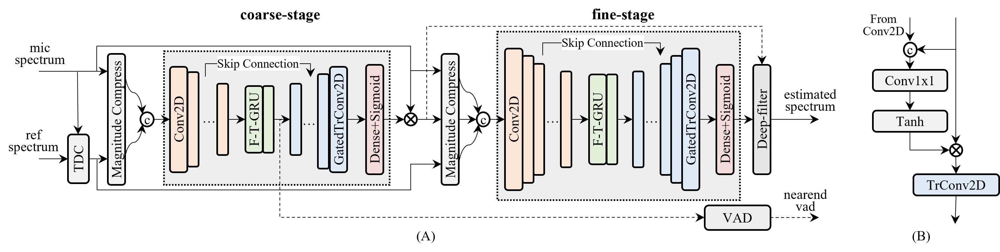

# TSPNN

This is the repository of our paper "**A TWO-STAGE PROGRESSIVE NEURAL NETWORK FOR ACOUSTIC ECHO CANCELLATION**" accepted by INTERSPEECH 2023.

In this paper, we propose a two-stage progressive neural network for acoustic echo cancellation with a modeling capacity from low-quality to high-quality, which is shown as follows:

# Repo details

1. The ***results*** directory contains the outputs of our proposed method on [the 2nd AEC Challenge blind testset](https://www.microsoft.com/en-us/research/academic-program/acoustic-echo-cancellation-challenge-interspeech-2021/).
2. Evaluation script is located in the ***eval*** directory.
3. The implementation details are in ***model*** directory.
